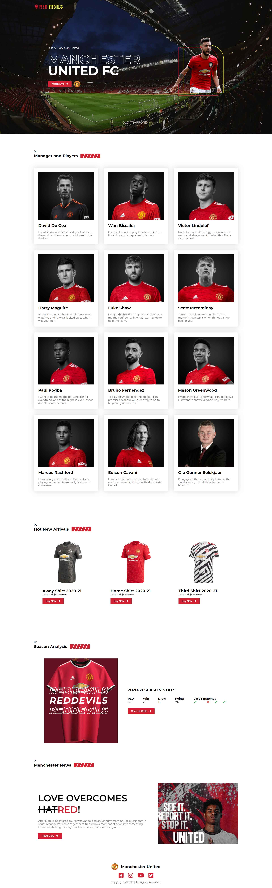

### `Red Devils Manchester United -` [Live Link](https://iftikharrasha.github.io/red-devils-manchesterunited/).

<p align="center">
  <a href="https://iftikharrasha.github.io/red-devils-manchesterunited/">
    
  </a>
</p>

<h1 align="center">
  Red Devils Manchester United
</h1>

<p align="center">
  Design and prototyping using Figma and built using HTML - CSS - bootstrap, Hosted on Github pages.
</p>



## 🚀 Installation

1.  Clone the repository and change directories

    ```shell
    git clone https://github.com/iftikharrasha/divine-workshop-danish.git
    cd red-devils-manchesterunited
    ```

2. Click index.html or Start the local server

    The site is now running at `http://localhost:3000`!
    

3.  **Open the source code and start editing!**
 
 ## 🎨 Color Reference
| Color          | Hex                                                                |
| -------------- | ------------------------------------------------------------------ |
| Black          |  `#000000` |
| Primary        |  `#D12132` |
| Accent        |  `#6C6C6C` |
| Secondary        |  `#FFF22D` |
| White          |  `#ffffff` |

